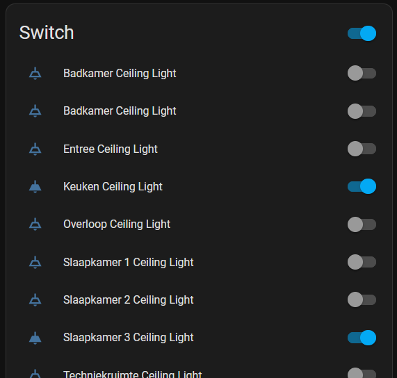

# streda-home-assistant

# THIS INTEGRATION IS BROKEN BECAUSE OF CHANGED TOKEN RENEWAL AT STREDA, IM WORKING ON RESOLVING IT...

Home assistant integration for Streda wired houses

Right now only includes ceiling lights (more coming soon)

Needs to be setup up using a refresh token from the Streda home owner panel and your location ID.
These can be gathered from the browser storage in every browser.

More information on setup will follow.

